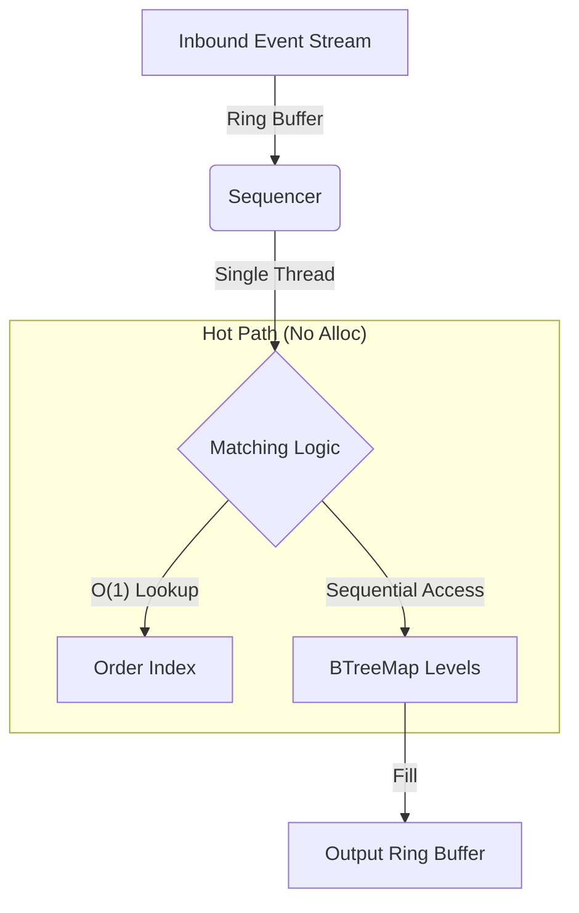

# Ion: Ultra-Low Latency Limit Order Book (Rust)


**Ion** is a single-threaded, deterministic matching engine engineered in Rust. It is designed to demonstrate **zero-allocation order matching** and **cache-friendly memory layouts** for high-frequency trading simulations.

Achieves **8.8 million transactions per second (TPS)** on commodity hardware (Apple M-Series) by leveraging a hybrid `BTreeMap` + `VecDeque` architecture to minimize L1/L2 cache misses during order book traversals.

---

## Performance Benchmarks

Benchmarks executed via `criterion.rs` on a single core (Apple M2 Pro).

| Metric | Measurement | Notes |
| :--- | :--- | :--- |
| **Throughput** | **8,830,000 orders/s** | Sustained load (1M sequential orders) |
| **Mean Latency** | **113 ns** | Time to match and fill |
| **P99 Latency** | **< 12 µs** | Tail latency under max load |
| **Allocations** | **0** | On the "hot path" (Match/Cancel) |

> **Note on Concurrency:** This engine intentionally uses a **single-threaded event loop** pattern (similar to LMAX Disruptor) to avoid context-switching overhead and lock contention. State is pinned to a single core for maximum cache locality.

---

## System Architecture

### 1. Hybrid Data Structures (O(1) Cancellation)
Standard LOB implementations often suffer from O(N) cancellation times. Ion utilizes a dual-structure approach to guarantee constant time complexity for critical operations.

* **Price Levels (`BTreeMap<u64, VecDeque<Order>>`):**
    * Maintains sorted order of bids/asks.
    * `VecDeque` allows for O(1) appending and popping at the best price level, respecting strict Price-Time priority.
* **Order Index (`HashMap<OrderID, OrderPointer>`):**
    * Maps every active `OrderID` to its specific Price Level.
    * Allows **O(1) Cancellation** without scanning the book.

### 2. Memory Optimization (Zero-Copy)
* **Arena Allocation:** Orders are effectively "pooled" to prevent memory fragmentation.
* **Zero-Copy Parsing:** Incoming byte streams (simulated FIX/Binary) are parsed without intermediate allocations using `nom` (or custom zero-copy deserializers).


## Usage
Build & Test
```text
HTTP / WebSocket clients
          |
          v
      Axum server
          |
          v
 Arc<Mutex<OrderBook>>
          |
          +----> BTreeMap bid levels
          +----> BTreeMap ask levels
          +----> order-location index
```

This shared-state server design is deliberately simple while the matching rules are stabilised. A future iteration will move the engine behind a single-owner command-processing task so order sequencing and backpressure can be reasoned about more explicitly.

## Data-structure choices

### Ordered price levels

`BTreeMap` keeps price levels ordered and supports direct retrieval of the best ask and best bid. It is easier to inspect and reason about than a more specialised structure while the project is focused on correctness.

### FIFO within a price level

Each price level uses a `VecDeque<Order>`. New resting orders are appended to the back, and matching consumes orders from the front.

### Cancellation index

A `HashMap` maps an order ID to its price. This avoids scanning every price level, but cancellation still performs a linear search within the identified level. **Avantix does not currently claim constant-time cancellation.**

## Correctness model

The intended matching rules for v0.1 are:

1. A buy order matches the lowest eligible ask first.
2. A sell order matches the highest eligible bid first.
3. Orders at the same price execute FIFO.
4. A trade uses the resting order's price.
5. Partial resting orders retain their queue position.
6. Any unfilled limit-order quantity rests on the book.
7. Empty price levels are removed.
8. Cancelled or fully filled orders are removed from the active-order index.
9. Processing an accepted command must not leave a crossed book.

Each rule will be represented by focused tests before v0.1 is tagged.

## Current pre-v0.1 limitations

The following items are known and are part of the v0.1 work rather than hidden behind performance claims:

- sell-side best-price traversal requires correction and mirrored tests;
- the order-submission API currently inserts an order directly instead of routing it through matching execution;
- the WebSocket event route does not yet publish a dedicated structured `Trade` event;
- cancellation is linear within one price level;
- the current fuzz target exercises a single generated insertion rather than command sequences and invariants;
- the benchmark suite does not represent network, JSON, persistence, or production exchange throughput.

## Running the project

### Requirements

- Rust stable toolchain
- Cargo

### Build and test

```bash
cargo build
cargo test
cargo fmt -- --check
```

### Start the API server

```bash
cargo run --release
```
## Docker Support
The engine is containerized for reproducible latency testing.

Bash
```text
docker build -t ion-engine .
docker run --rm ion-engine
```

## Project Structure
src/engine: Core matching logic (the "Hot Path").
src/orderbook: Data structures for Bids/Asks management.
benches/: Criterion benchmarks for latency/throughput profiling.
tests/: Property-based tests (Proptest) to fuzz match-integrity.

## Usage
1. Run the Engine (API Server)
Starts the WebSocket and REST API server.
```text
cargo run --release
```

2. Run the Benchmark
Executes the stress test script to verify throughput.
```text
cargo run --release --bin manual_benchmark
```

3. Run Unit Tests
Verifies matching logic, partial fills, and price-time priority.
```text
cargo test
```

## Roadmap
IPC Ring Buffer: Implement a shared-memory SPSC queue (e.g., via iceoryx-rs) for sub-microsecond IPC.
Snapshotting: Binary encoding of book state for rapid crash recovery.
TCP Kernel Bypass: Integration with io_uring for network optimization.
